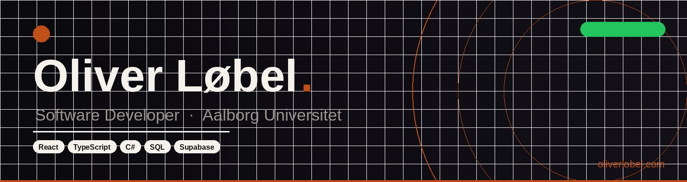

<!-- =========================
     Oliver Løbel • GitHub Profile README
     ========================= -->

<table>
<tr>
<td valign="top"></td>
<td valign="top"></td>
</tr>
</table>

 

 

- Bachelor student in **Software Engineering**
- Passionate about **software development**, backend systems, and building real-world projects
- Interested in **programming**, performance, and how systems work under the hood
- Always working on new ideas — from small utilities to full-stack applications
- Based in Denmark

  <a href="https://github.com/Bilmpz?tab=repositories" target="_blank"><b>Portfolio</b></a>
  ·
  <a href="https://oliverlobel.dk/" target="_blank"><b>Website</b></a>
  ·
  <a href="https://www.linkedin.com/in/oliver-l%C3%B8bel-6a7435369/" target="_blank"><b>LinkedIn</b></a>
  ·
  <a href="https://www.oliverlobel.dk/kontakt" target="_blank"><b>Kontakt</b></a>

  

---
## Backend Languages

  
  
  
  

---
## Frontend Languages

  
  
  
  
          
          

---
## Backend & Databases

---
## Tools & Design

  
  
  
  
  

---
## Operating Systems

 

---
